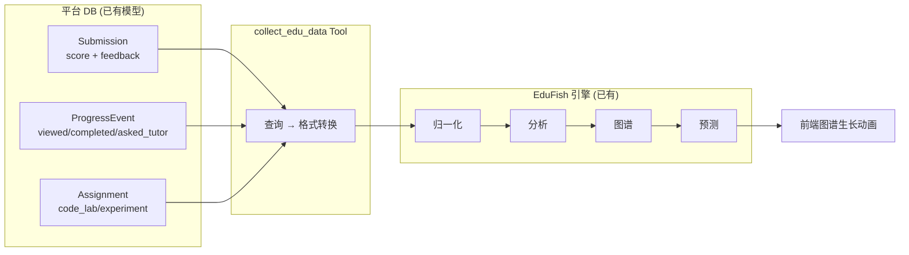

# EduFish 全局感知 Agent — 实施完成

## 演示


---

## 新增 & 修改文件

### 🆕 新建

| 文件 | 行数 | 作用 |
|------|------|------|
| [edu_collector_tools.py](file:///home/shiro/July/脑机、人工智能导论/backend/app/agents/tools/edu_collector_tools.py) | ~290 行 | 3 个 Agent Tool：`collect_edu_data` / `trigger_edu_analysis` / `check_edu_analysis_status` |

### ✏️ 修改

| 文件 | 改动 |
|------|------|
| [definitions.py](file:///home/shiro/July/脑机、人工智能导论/backend/app/agents/definitions.py) | +`edu-collector` Agent 定义 + system prompt |
| [edu.py (API)](file:///home/shiro/July/脑机、人工智能导论/backend/app/api/edu.py) | +`/api/edu/collect-and-analyze` + `/api/edu/collect-preview` |
| [edu.js (前端API)](file:///home/shiro/July/脑机、人工智能导论/frontend/src/api/edu.js) | +`collectAndAnalyze()` + `collectPreview()` |
| [EduFishStudioView.vue](file:///home/shiro/July/脑机、人工智能导论/frontend/src/views/EduFishStudioView.vue) | +AGENT 采集按钮 + `runAgentCollection()` + CSS 样式 |

---

## 数据流验证结果

### collect-preview（干跑采集）

```
✅ courses: 2 (人工智能导论, 脑与认知科学导论)
✅ teachers: 1 (韩老师)
✅ students: 4 (小周、小林、小陈、小许)
✅ feedback_items: 7 (从 Submission.feedback + 辅导记录)
✅ grade_records: 6 (从 Submission.score)
✅ attendance_records: 4 (从 ProgressEvent 按日聚合)
```

### collect-and-analyze（完整流程）

```
✅ 数据采集 → 归一化 → 创建 dataset → 触发分析 → 构建图谱 → 生成报告
✅ 图谱生成: 6 nodes (School/Department/Teacher/Course/2 Students) + 14 edges
✅ 分析状态: completed (progress: 100%)
```

---

## 架构总结



> [!TIP]
> 整个系统**没有外部依赖**。hermes-agent 的设计思想（tool 注册表、cron 编排、Agent 定义分离）被吸收到了平台自身的 `backend/app/agents/` 架构中。不需要部署 hermes。

---

## 各 Tool 说明

| Tool 名 | 输入 | 输出 | 数据来源 |
|---------|------|------|---------|
| `collect_edu_data` | `course_id`, `time_range_days` | EduFish dataset payload | `Submission` → grades/feedback, `ProgressEvent` → attendance, `User` → students/teachers |
| `trigger_edu_analysis` | `collected_payload`, `audience_role` | `job_id`, `analysis_id`, `report_id` | 调用现有的 `EduStorageService` + `JobQueue` |
| `check_edu_analysis_status` | `job_id` | 任务状态和进度 | 调用现有的 `JobQueue.get()` |
